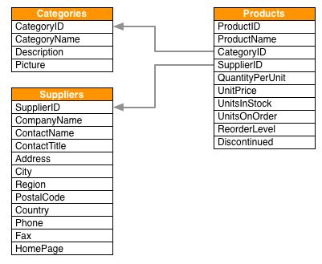

# SpringNeo4jDemo

This projects is to purely demonstrate how to integrate Neo4J in a java project using Spring Data Neo4j (SDN)

SDN provides a lot of out of the box features like Spring Data JPA and reduces the efforts needed to configure and communicate with a neo4j database server.

The dataset used here is a small part of the north wind dataset:

We can map these table into the graph database where each table represents a node.

The data is ingested into a neo4j database.

This spring boot app helps to access the data from the following endpoints:

/products
/suppliers
/categories
/suppliers/id

This project can we further scaled with customer cypher queries using @Query annotation and other CRUD operations however the main goal of this github repository is to demonstrate how the integration of spring and neo4j.

Testing will be implemented soon using Junit , DataNeo4jTest and Testcontainer
